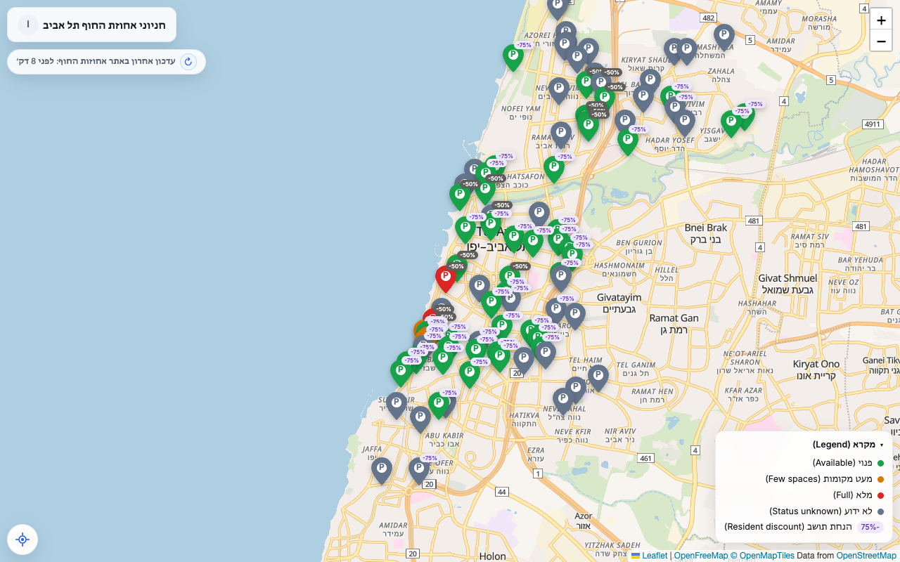
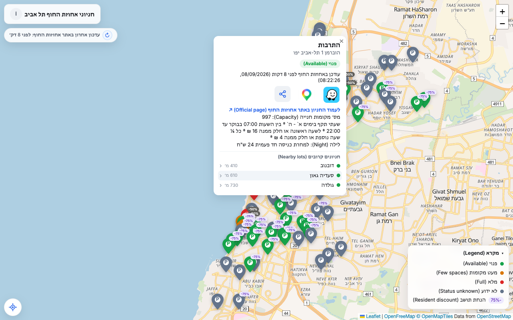

# חניוני אחוזת החוף תל אביב (Tel Aviv Parking Map)

A single static page showing live parking-lot availability for Tel Aviv's
Ahuzot HaHof coastal parking lots on a map, color-coded by status
(available / few spaces / full / closed). UI is Hebrew-first, with English
in parentheses for the mixed Hebrew/English audience it's built for.

Live: https://chenmu10.github.io/tel-aviv-parking-map/ _(once GitHub Pages is enabled on the repo)_

## Screenshots

| Live map | Lot popup |
|---|---|
|  |  |

## Features

- Live availability map with color-coded status pins, filtered to exclude closed lots
- Collapsible legend explaining the status colors
- Each lot's popup shows its address, status, when the source last updated it
  (with a stale-data warning past 30 minutes), tariffs, and capacity
- "חניונים קרובים": the 3 nearest not-full lots in every popup, tap to jump to them
- One-tap navigation to a lot via Waze or Google Maps (by exact coordinates)
- Share button per lot (native share sheet / copy link) with `#lot=<id>` deep
  links that open the shared lot's popup directly
- Freshness pill showing when the source data last changed, with a manual
  refresh button and an outage state when the feed serves no statuses
- A link to the lot's official ahuzot.co.il page when one can be matched by name
- "Center map on my location" button; map view (center+zoom) persists across reloads
- Vector basemap (OpenFreeMap Bright via MapLibre GL, with Hebrew RTL label
  support) and an automatic OSM raster fallback when WebGL/CDN is unavailable
- Installable as a home-screen app (PWA manifest + icons)
- Auto-refreshes every 2 minutes, paused while the tab/screen is backgrounded
- Free, cookie-free page-view analytics via Cloudflare Web Analytics
- Small "i" info button next to the title for contact info and data-source links

Data source: [Tel Aviv Municipality GIS open data](https://gisn.tel-aviv.gov.il/arcgis/rest/services/IView2/MapServer/970),
layer 970 ("חניוני אחוזות החוף"), fetched directly from the browser — no backend.
Per-lot capacity and resident-discount figures are hand-refreshed snapshots
scraped from each lot's ahuzot.co.il page (the GIS feed leaves those mostly empty).

## Run locally

```
python3 -m http.server
```

Then open `http://localhost:8000`.
